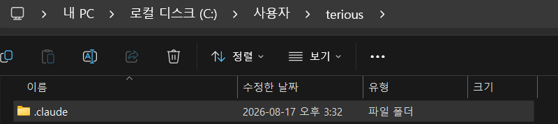

# /init으로 자동 생성
- 프로젝트 루트 디렉토리에서 Claude Code 실행 必
- Claude는 현재 디렉토리 기준으로 파일을 탐색하기 때문에 엉뚱한 폴더에서 실행하면 프로젝트 구조를 파악하지 못 한다.
- `/init` 명령어로 `claude.md`를 자동 생성한다. 
    - `claude.md` : 프로젝트의 모든 컨텍스트를 다 담고 있는 하나의 파일
    - Claude가 프로젝트를 분석해서 프로젝트 설명서를 만들어준다.
    - 프로젝트가 크면 클수록 Claude가 모든 파일을 읽는데 시간과 토큰 소모량이 많이 든다. 따라서 `claude.md`에 프로젝트의 모든 구조를 정리해 놓으면 Claude가 해당 파일만 읽고 바로 Task를 실행할 수 있다.(효율적)

# 계층 구조 (글로벌 vs 프로젝트)
- **`글로벌`** : `~/.claude/claude.md`(모든 프로젝트 공통)

- **`프로젝트`** : `프로젝트루트/claude.md`(해당 프로젝트에만 적용)
```
ex)
- 글로벌 → '항상 한국어로 답변해라' 같은 공통 규칙을 넣는다.
- 프로젝트 → 해당 프로젝트의 아키텍쳐, 컨벤션 등을 넣는다.
```

# claude.md 구성 - 절대 규칙 · 아키텍처 · 빌드/테스트 · 도메인 · 컨벤션
- **`절대 규칙`** : 위반하면 안 되는 금지 사항(최상단 배치)
```
ex)
## Critical Rules (절대 규칙)
- Production DB에 직접 쿼리 금지
- .env 등 secret file은 절대 commit 금지
- main branch에 직접 push 금지, 반드시 PR을 통해 merge
```
- **`아키텍처`** : 폴더 구조, 기술 스택 등
```
ex)
## Architecture (아키텍처)
모노레포 구조, Turborepo 기반
apps/
    web/    → Next.js 14 (App Router) - 고객용 프론트엔드
    admin/  → Next.js 14 - 어드민 대시보드
    api/    → Express + TypeScript - REST API 서버
packages/
    ui/     → 공유 UI 컴포넌트 (Shadcn/ui 기반)
    db/     → Prisma ORM + PostgreSQL
    shared/ → 공통 타입, 유틸리티

## Tech Stack (기술 스택)
- Frontend: Next.js 14, TypeScript, Tailwind CSS, Zustand
- Backend: Express, TypeScript, Prisma ORM
- DB: PostgreSQL (Supabase), Redis (d)
- Infra: Vercel (MEE), Railway (API), GitHub Actions (CI/CD)
```
- **`빌드/테스트`** : 개발 서버, 테스트, 배포 명령어 등
```
ex)
## Build & Test Commands (빌드/테스트)
'''bash
pnpm install    # 의존성 설치
pnpm dev        # 전체 dev 서버 실행
pnpm build      # 전체 빌드
pnpm test       # Vitest 전체 테스트
pnpm test:e2e   # Playwright E2E 테스트
pnpm lint       # ESLint + Prettier 체크
pnpm db:migrate # Prisma 마이그레이션 실행
pnpm db:seed    # 시드 데이터 삽업
'''
```
- **`도메인`** : 비즈니스 용어, 데이터 흐름 등
```
ex)
## Domain Context (도메인 컨텍스트)
- ** Product **: 상품. 여러 Variant(옵션 조합)를 가짐
- ** Variant **: 색상/사이즈 등 옵션 조합. 각각 독립된 재고(stock) 보유
- ** Cart → Order → Payment **: 장바구니 → 주문 생성 → 결제 순서
- ** Fulfillment **: 배송 처리, 주문 완료 후 자동 생성
```
- **`컨벤션`** : 네이밍, 커밋, 패턴 규칙 등
```
ex)
## Coding Conventions (코딩 컨벤션)
- 컴포넌트 : PascalCase (`ProductCard.tsx`)
- 유틸/훅 : camelCase (`useCart.ts`, `formatPrice.ts`)
- API 라우트: kebab-case (`/api/order-items`)
- 커밋 메시지: Conventional Commits (`feat:`, `fix:`, `chore:`)
- 커밋 메시지는 영어, 코드 주석은 한국어 허용
- React 컴포넌트는 named export 사용 (default export 금지)
- API 응답은 항상 `{ success, data, error }` 형태로 통일

## Key Patterns (핵심 패턴)
- Server Components 우선, 클라이언트 상태 필요할 때만 `"use client"`
- API 에러는 `AppError` 클래스로 통일 (`packages/shared/errors.ts`)
- DB 접근은 반드시 `packages/db`의 repository 패턴을 통해서만
- 환경변수는 `packages/shared/env.ts`에서 zod로 검증 후 사용
```

> **💡 IMPORTANT**
> - **루트 디렉토리 claude.md는 300줄 이하로 유지! 내용이 너무 길면 매 대화마다 토큰을 낭비한다.**
> - **만약 claude.md의 내용이 길어질 것 같으면 폴더별(web, api, db 등)로 claude.md를 만드는 것도 방법**

# 트리거 키워드 & 팀 공유
- `claude.md`에는 트리거 키워드를 등록할 수 있다.
```
ex) claude.md에 아래와 같은 트리거 키워드 내용 추가
## Trigger Keywords
사용자가 아래 키워드를 입력하면 해당 워크플로우를 자동 실행한다.

### '배포' or 'ship' → 이게 키워드임, 프롬프트에 해당 키워드가 감지되면 아래 과정을 알아서 수행하는 것이다.
1. **테스트 실행** : `cd apps/api && python -m pytest` 로 백엔드 테스트 전체 실행
2. **테스트 실패 시** : 실패 내용을 보고하고 중단. commit/push 하지 않음
3. **테스트 전체 통과 시** : 아래 순서로 실행
    - `git add -A` (변경된 파일 전체 스태이징)
    - 변경 내용을 분석하여 적절한 커밋 메시지 자동 작성
    - `git commit`
    - `git push origin <현재브랜치>`
4. push 완료 후 결과 요약 출력

cf) 위 내용은 아래의 프롬프트를 통해 만들어졌다.
claude.md에 트리거 키워드 설정해줘. test 돌리고 모두 패스하면 git commit push를 한 번에 해주는 커맨드 부탁해
```
```
ex)
- "build the app" → npm run build 실행 후 결과 리포트
- "deploy staging" → staging 환경에 배포
```

# TIP
- **`규칙 우선순위`** : 규칙은 위에서 아래로 적용, 가장 중요한 규칙을 맨 위에 둔다.
- **`직접 수정하지 마라`** : Claude에게 "방금 우리가 정한 패턴을 `claude.md`에 추가해"라고 시키면 기존 내용과 자연스럽게 병합된다.
- **`트리거 키워드`** : `claude.md`에 트리거를 등록하면 짧은 명령으로 정해진 플로우를 자동으로 실행할 수 있다.
- **`팀 공유`** : `claude.md`를 Repository에 커밋하면 팀 전체가 같은 규칙으로 Claude를 사용할 수 있다.
    - Anthropic에서는 이것을 COMPOUND ENGINEERING이라고 한다.
    ```
    ex)
    - 프로젝트 claude.md → Repository에 커밋, 팀 전체가 같은 규칙으로 Claude 사용
    - 글로벌 claude.md → 개인 설정(로컬 경로, API Key 등)은 커밋 X
    - 핵심 원칙 → [팀 공통 = 프로젝트 / 개인 전용 = 글로벌]로 깔끔하게 분리
    ```